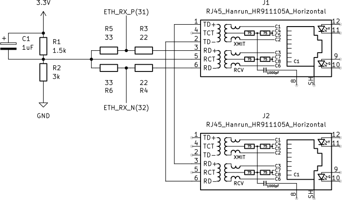

# Interface Ethernet 10baseT

Nesta prática, vamos implementar um receptor para a camada física de uma rede Ethernet do tipo [10baseT](https://en.wikipedia.org/wiki/10BASE-T). A lógica será capaz de decodificar os sinais elétricos da interface, extrair os bits de dados através da decodificação Manchester, e localizar o início de um quadro Ethernet para então extrair seu conteúdo.

## Dependências

No Arch Linux, utilize os pacotes a seguir obtidos do [AUR](https://aur.archlinux.org) ou precompilados do [Chaotic AUR](https://aur.chaotic.cx):

```bash
sudo pacman -S bluespec-git bluespec-contrib-git yosys-git nextpnr-git prjapicula verilator openfpgaloader
```

Se você usa outra distribuição, prefixe todos os comandos descritos neste documento com `./run-docker` para executá-los dentro de um container.

## Síntese e execução dos testes

Para sintetizar a lógica para FPGA, execute `make`. Para carregar em um kit de desenvolvimento, execute `make load`.

Os testes desta prática leem uma sequência de bits da entrada padrão e geram uma saída que deve ser comparada com um gabarito. Para facilitar, o script `./run-grader` automatiza a execução de todos os testes com as entradas corretas e verifica se geram as saídas correspondentes.

## Implementação

As partes do código que estão faltando são descritas a seguir. Elas são independentes e não precisam ser implementadas em nenhuma ordem particular.

### ManchesterDecoder

Implemente o módulo [mkManchesterDecoder](ManchesterDecoder.bsv), que deve receber como entrada um fluxo de bits amostrados a 81 MHz e produzir como saída os bits de dados correspondentes após a decodificação [Manchester](https://en.wikipedia.org/wiki/Manchester_code).


Os dados em uma rede 10baseT são transmitidos a 10 Mbit/s. Como nosso sinal é amostrado a 81 MHz, cada bit de dados (símbolo) corresponde a aproximadamente 8 amostras (`81 MHz / 10 Mbit/s ≈ 8.1`). Pequenas diferenças entre os clocks do transmissor e do receptor podem fazer com que essa quantidade varie entre 7 e 9 amostras.

Na amostra central do símbolo (representada pelo tracejado verde na figura), **sempre** ocorre uma transição do sinal. Essa transição é de `0` para `1` se o bit original for `1`, ou de `1` para `0` se o bit original for `0`. Nosso decodificador deve localizar essas transições e produzir um bit de saída para cada uma delas.

Na amostra inicial do símbolo, pode ocorrer uma transição que devemos ignorar (ou seja, não devemos produzir saída nenhuma quando ela acontecer). Essas transições acontecem sempre que há sequências de bits iguais na entrada original, e estão representadas pelo tracejado cinza na figura.

Em resumo, o decodificador deve sincronizar sua fase em todas as transições (tanto nas contornadas por verde quanto nas contornadas por cinza), mas deve produzir saída apenas nas transições representadas por verde (quando a fase indicar que estamos no meio de um símbolo).

Ou seja, seu módulo deve:
1.  Manter um contador de fase para saber se está no início ou no meio de um símbolo. O ideal é que o meio do símbolo ocorra na 4ª amostra de um ciclo de 8.
2.  A cada transição no sinal de entrada, ajustar seu contador de fase para se realinhar com o clock do transmissor.
3.  Produzir um bit de saída (`outFifo.enq(Valid(bit))`) apenas quando uma transição ocorrer no meio de um símbolo.
4.  Ao receber um sinal `Invalid`, que é gerado pelo [mkFrameDelimiter](FrameDelimiter.bsv) para marcar o fim de um quadro, você deve reiniciar o estado do decodificador e repassar esse sinal para a saída (`outFifo.enq(Invalid)`).

[Neste link](https://github.com/ctf-br/ctf-sbseg2024/blob/5e625e52c7160c92b9695fac49d095c96c595d08/seized_photos/private/solver/solve.py#L57-L89) há uma implementação em Python similar ao que este módulo de hardware deve implementar.

### SFDLocator

Implemente o módulo [mkSFDLocator](SFDLocator.bsv), que recebe os bits decodificados do `mkManchesterDecoder` e localiza o fim do Delimitador de Início de Quadro (SFD - *Start Frame Delimiter*). A saída do módulo deve conter apenas os bits do quadro Ethernet útil, descartando o preâmbulo e o SFD.

A estrutura de um [quadro Ethernet](https://en.wikipedia.org/wiki/Ethernet_frame#Structure) começa com:
-   **Preâmbulo (7 bytes):** Uma sequência de bits `1` e `0` alternados. Essa sequência não necessariamente será recebida completa pelo módulo, pois pode ser detectada tardiamente pelo `mkFrameDelimiter`.
-   **SFD (1 byte):** A sequência `10101011`.

Seu módulo deve processar os bits de entrada e, ao detectar a sequência `11` (que marca o final do SFD), deve começar a passar os bits subsequentes para a saída.
-   Enquanto o SFD não for encontrado, não produza nenhuma saída.
-   Após encontrar a sequência `11`, todos os bits `Valid` seguintes da entrada devem ser repassados como `Valid` na saída.
-   Se a entrada for `Invalid` (usado como marcador de fim de quadro), repasse `Invalid` para a saída e reinicie o estado do módulo para procurar um novo SFD.

## Teste de bancada



Para um teste em hardware, conecte J1 à placa de rede de um computador e conecte J2 a um hub Ethernet 10baseT, para que o hub gere link test pulses (LTPs). O conector J2 é necessário pois esta versão da prática ainda não implementa a parte de transmissão do protocolo Ethernet, assim precisamos que algum outro equipamento gere os LTPs para que o computador acredite que o enlace está de pé.

Configure a interface de rede do seu computador com um endereço IP fixo, por exemplo `10.1.2.2/24`.

Gere tráfego na rede e observe a saída na UART. O `Top.bsv` está configurado para desserializar os bits recebidos em bytes e enviá-los para o seu computador via USB.

Note, no entanto, que o adaptador USB UART da Tang Nano 9k é um FTDI emulado que é um pouco bugado. Para funcionar corretamente, um truque que parece dar certo sempre é, antes de carregar o bitfile na placa (ou seja, antes de fazer `make load`), usar o procedimento a seguir para (pré-)configurar a UART e abrir o picocom em seguida:

1.  Execute `stty -F /dev/ttyUSB1 3000000 cs8 -parenb cstopb`.

2.  Execute o picocom e mantenha-o executando durante os seus testes: `picocom -b 3000000 -d 8 -p 1 -y n /dev/ttyUSB1`.

3.  Se você desejar, é possível ler os dados recebidos da UART em formato hexadecimal, o que é útil pois tratam-se de dados binários. Para isso, feche o picocom com `Ctrl+a` seguido de `Ctrl+q`, e execute `hexdump -C /dev/ttyUSB1`.

Para gerar tráfego, há duas formas recomendadas:

1.  O comando `sudo arping -c1 -I enp5s0 10.1.2.3`. Substitua `enp5s0` pelo nome da interface de rede do seu computador. Isso deve gerar uma saída parecida com a seguinte:

```
00000000  ff ff ff ff ff ff f8 75  a4 7b 23 45 08 06 00 01
00000010  08 00 06 04 00 01 f8 75  a4 7b 23 45 0a 01 02 02
00000020  ff ff ff ff ff ff 0a 01  02 03 00 00 00 00 00 00
00000030  00 00 00 00 00 00 00 00  00 00 00 00 63 bc c4 81
```

2.  O comando `sudo arp -s 10.1.2.3 de:ad:be:ef:ca:fe` seguido do comando `poetry run python sender.py` dentro do diretório `software` deste repositório. As mensagens de *lorem ipsum* transmitidas pelo computador devem aparecer dentro dos quadros observados na UART.

## Trabalhos futuros

Esta é uma versão preliminar da prática. Em ofertas futuras da disciplina, pretendemos desenvolver uma placa de rede completa, capaz de enviar e receber quadros e lidar com problemas de acesso ao meio, como colisão.

Acompanhe este repositório para conhecer as próximas edições!
